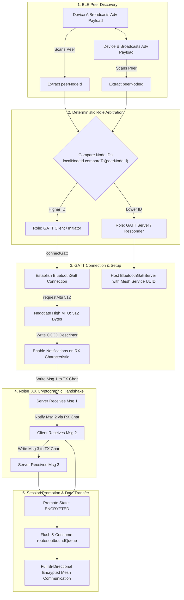

# Nearby — Off-Grid Decentralized Peer-to-Peer Mesh Network

**Nearby** is an Android-based decentralized, peer-to-peer mesh communications platform designed for zero-connectivity, disaster-response, and tactical environments. Nearby operates entirely independent of cellular towers, satellite infrastructure, or internet access by leveraging Bluetooth Low Energy (BLE) and Wi-Fi Direct for local, ad-hoc device networking.

---

## Key Features

- **Decentralized BLE Mesh**: Autonomous peer discovery and multi-hop message relay over Bluetooth Low Energy.
- **End-to-End Encryption (E2EE)**: Built on the **Noise_XX** handshake protocol (Curve25519, ChaChaPoly1305, BLAKE2s) ensuring mutual authentication, forward secrecy, and identity hiding.
- **Out-of-Band Verification**: SAS (Short Authentication String) numeric code comparison and QR code exchange to counter Man-in-the-Middle (MITM) attacks.
- **Store-and-Forward Mesh Routing**: Dynamic multi-hop packet routing with TTL management, deduplication caches, and automatic route discovery.
- **High-Bandwidth Off-Grid Data**: Wi-Fi Direct negotiation for large file distribution and real-time low-latency push-to-talk (PTT) voice streaming.
- **Emergency Broadcast**: High-priority SOS broadcast beaconing with GPS coordinates and victim status tags.
- **Modern Jetpack Compose UI**: Clean, responsive Android 14+ UI with real-time topology map, peer radar, and encrypted chat channels.

---

## Mesh & Transport Architecture

The core of the Nearby physical networking layer is the deterministic GATT transport and Noise_XX handshake engine, resolving connection races and enabling seamless bi-directional packet delivery.



---

## Technical Specifications

| Subsystem | Technology / Standard | Details |
|---|---|---|
| **Discovery** | BLE Advertising & Scanning | Custom 16-byte Service Data UUID payload with 8-byte Node ID |
| **GATT Transport** | `BleGattTransport` | MTU 512 negotiation, API 33+ notification handling, write chunking |
| **Handshake** | Noise Protocol Framework | Pattern `Noise_XX_25519_ChaChaPoly_BLAKE2s` (3-message mutual authentication) |
| **Packet Protocol** | Binary Framing (`MeshPacket`) | Magic header `0x4E 0x42` ('NB'), type byte, TTL, sequence numbers |
| **Voice / Large Files**| Wi-Fi Direct (P2P) | High-throughput direct socket streams for audio and binary payloads |
| **Local Storage** | Room DB / In-memory Store | Encrypted message persistence and contact trust states |

---

## Building and Testing

### Prerequisites
- Android Studio Ladybug / Meerkat or later
- Android SDK 35+ (API 34/35/37)
- JDK 17 or JDK 21

### Run Unit Tests
```bash
./gradlew test
```

### Build Debug APK
```bash
./gradlew assembleDebug
```

---

## License

This project is distributed under the Apache License 2.0.
